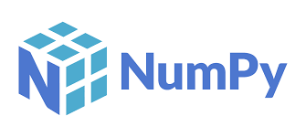
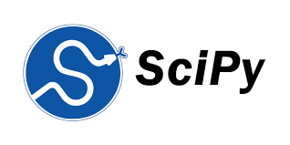
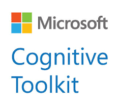
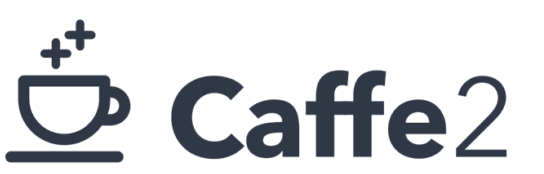
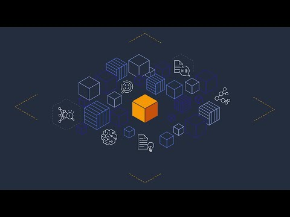

# LIBRERIAS y FRAMEWORK QUE UTILIZAN  LA INTELIGENCIA ARTIFICIAL
* **Pandas:**
Pandas es una de las librerías de python más útiles para los científicos de datos. Las estructuras de datos principales en pandas son Series para datos en una dimensión y DataFrame para datos en dos dimensiones.

* **Numpy:**
Numpy es una librería de Python para Machine Learning caracterizada por ser la librería de procesamiento de arrays por excelencia. Contiene una gran colección de funciones que permiten realizar cálculos matemáticos complejos sobre arrays multidimensionales.

* **SciPy:**
La librería Scipy está formada por una serie de módulos que proporcionan funcionalidad para resolver el cómputo de tareas científicas y analíticas.

* **Seaborn:**
Seaborn es una librería gráfica basada en matplotlib, especializada en la visualización de datos estadísticos. Se caracteriza por ofrecer un interfaz de alto nivel para crear gráficos estadísticos visualmente atractivos e informativos.

* **Tensor Flow:**
demuestra ser un marco robusto de código abierto que admite el aprendizaje profundo y al que se puede accederincluso desde un dispositivo móvil.
Tensor flow se considera una herramienta adecuada para el desarrollo de programas estadísticos. 

* **Microsoft CNTK:**
Microsoft CNTK es un marco de código abierto más rápido y versátil basado en redes neuronales que admiten la remodelación de texto, mensajes y voz.

* **Caffe:**
Caffe es una red de aprendizaje profundo con un conjunto precargado de redes neuronales entrenadas. Esta debería ser su primera elección si su fecha límite está cerca.

* **Amazon machine learning**
Ser un participante de tendencia en la comunidad de IA, Aprendizaje automático de Amazon ofrece soporte de alta gama en el desarrollo de herramientas de autoaprendizaje.

